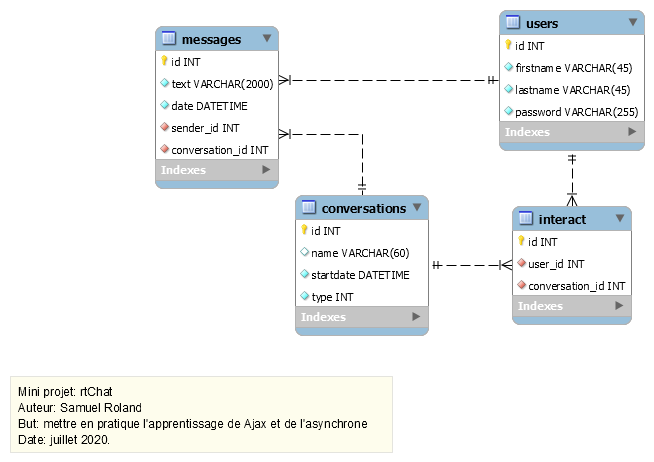

# rtChat


## Introduction
This little project has been realized in approximately 12 hours. The code is not very good (not commented, variables names are not good chosen in several cases, ...) but the goal of this challenge was not to have a good quality but to realize a real time chat in a very short time, to put into practice Ajax after [an online course on OpenClassrooms](https://openclassrooms.com/fr/courses/5543061-ecrivez-du-javascript-pour-le-web) and have a little better understanding with asynchronous execution. This app is not secure and contains several types of bugs.

## Features:
List of little features implemented:
1. Login and logout
1. Display of conversations of the connected user
1. Send a message in a group or in a private conversation
1. Empty (delete) the draft
1. Get the new messages when the user click on the email icon
1. Get new messages in real time without any user interaction (just enable the "real time mode" and then all new messages will arrive instantly when they are sent)
1. Display new messages in the current chat displayed.
1. Display counters of new unread messages for conversations not currently displayed.
1. Create a new conversation (private or group) with an other user
1. Display of an empty conversation (without any messages) possible

## Interface
The login:  


A private conversation displayed:  


A group conversation displayed:  


Notifications when new messages are detected:


Little form to create a conversation:  


## How to install to try:
### Prerequesites:
- a PHP server
- a MySQL server
- NPM

### Process:
1. Clone the repository or download the zip file.
1. Start the MySQL server, connect as database administrator account (like `root`)
1. Create a new empty db with `rtchat` name
1. Create a user called `rtChatApp` with a password (here `mypassword`)
1. Open the folder `rtChat` in a shell and type:
```
cd app
npm install
copy .const.php.example .const.php
```
1. Open the folder rtChat in your favorite IDE. Edit the .const.php to fill informations for database. Here is an example with the values on top:
```
$user = "rtChatApp";
$pass = "mypassword";
$dbhost = "localhost";
$dbname = "rtchat";
$debug = false;
```
1. Start a PHP server with the `app` folder as document root (with your IDE or with the following command `php -S localhost:8080`)
1. Access the web app in your browser: `localhost:8080`
1. Login as Alice, Bob or Jen (the password is the firstname).
1. If you see the differents conversations of the user chosen, it's finished ! You can try the app by writing a first message.

**To try real time mode, login in 2 different browsers with 2 users and enable this mode on both side. Then send a message in private conversation with the other user and see what happens on the other side (the user that receive the message).**


## The database:
The logic data model is here (you can modify this schema with the MySQL Workbench file `db/db-rtchat.mwb`):  


## How the real time mode works ?
When real time mode is enabled, the browser send a request frequently (like every second) for each conversation, to ask the server if there is new messages. As my database doesn't contain any fields about unread or read status, the app need to send the last displayed message id to be able to send only messages that are sent after this one.
