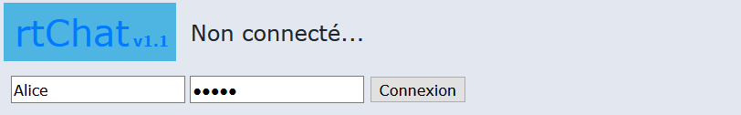
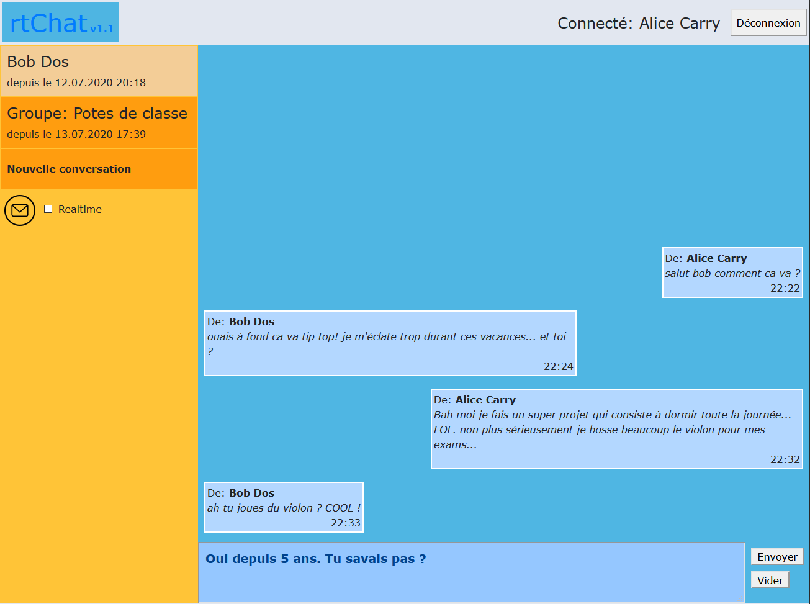
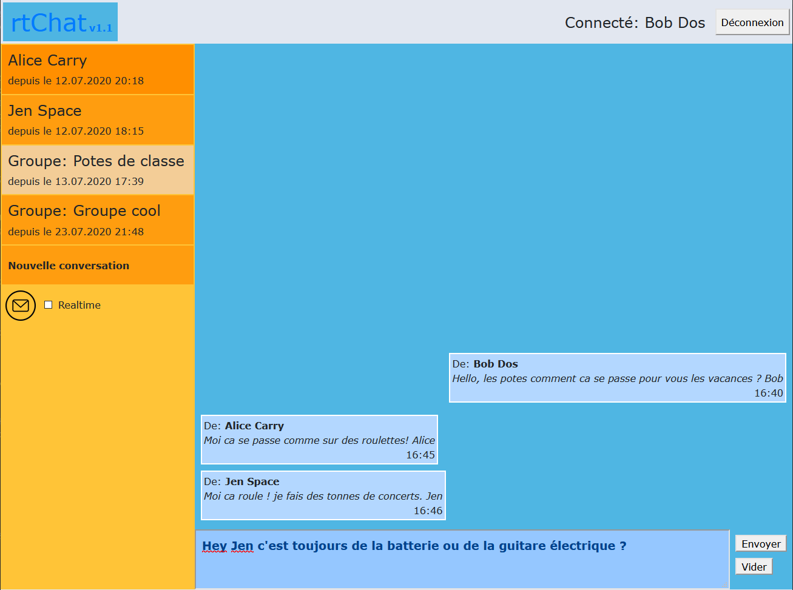
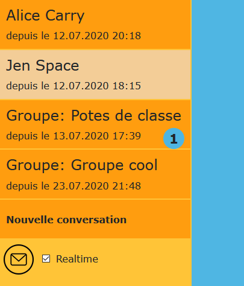
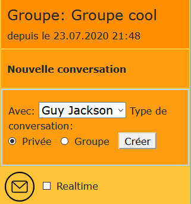

# rtChat
A very basic real time chat in a web app to put into practice Ajax and asynchronous requests.

## Introduction
This little project has been realized in approximately 12 hours. The code is not very good (not commented, variables names are not good chosen in several cases, ...) but the goal of this challenge was not to have a good quality but to realize a real time chat in a very short time, to put into practice Ajax after [an online course on OpenClassrooms](https://openclassrooms.com/fr/courses/5543061-ecrivez-du-javascript-pour-le-web) and have a little better understanding with asynchronous execution.

## Interface
The login:  

A private conversation displayed:  

A group conversation displayed:  

Notifications new messages are detected:  

Little form to create a conversation:  

## Features:
List of little features implemented:
1. Login and logout
1. Display of conversations of the connected user
1. Send a message in a group or in a private conversation
1. Empty (delete) the draft
1. Get the new messages when the user click on the email icon
1. Get new messages in real time without any user interaction (just enable the "real time mode" and then all new messages will arrive instantly when they are sent)
1. Display new messages in the current chat displayed.
1. Display counters of new unread messages for conversations not currently displayed.
1. Create a new conversation (private or group) with an other user
1. Display of an empty conversation (without any messages) possible

## How to install:
